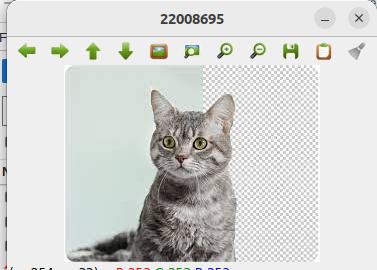
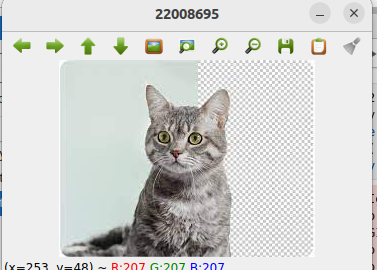
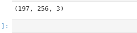
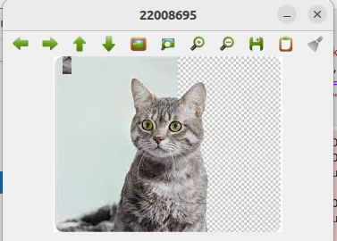

# READ AND WRITE AN IMAGE

## AIM:

To write a python program using OpenCV to do the following image manipulations.
i) Read, display, and write an image.
ii) Access the rows and columns in an image.
iii) Cut and paste a small portion of the image.

## Software Required:

Anaconda - Python 3.7

## Algorithm:

### Step1:

Choose an image and save it as a filename.jpg

### Step2:

Use imread(filename, flags) to read the file.

### Step3:

Use imshow(window_name, image) to display the image.

### Step4:

Use imwrite(filename, image) to write the image.

### Step5:

End the program and close the output image windows.

## Program:

### Developed By: ABRIN NISHA A
### Register Number: 212222230005


i) #To Read,display the image
```
import cv2 as cv
capture=cv.imread("C:/Users/abhid/Downloads/a.jpg")
cv.imshow('PIC',capture)
cv.waitKey(0)
```
ii) #To write the image
```
import cv2 as cv
capture=cv.imread("C:/Users/abhid/Downloads/a.jpg")
cv.imwrite("photo.jpg",capture)
cv.imshow("PIC",capture)
cv.waitKey(0)
```
iii) #Find the shape of the Image
```
import random
import cv2 as cv
capture=cv.imread("C:/Users/abhid/Downloads/a.jpg")
print(capture.shape)
```
iv) #To access rows and columns

```
import random
import cv2 as cv
capture=cv.imread("C:/Users/abhid/Downloads/a.jpg")
for i in range(70,90):
    for j in range(110,170):
        capture[i][j]=[0,0,0]
cv.imshow("PIC",capture)
cv.waitKey(0)
```
v) #To cut and paste portion of image
```
import random
import cv2 as cv
capture=cv.imread("C:/Users/abhid/Downloads/a.jpg")
tag=capture[100:120,110:120]
capture[0:20,10:20]=tag
cv.imshow("PIC",capture)
cv.waitKey(0)
```

## Output:

### i) Read and display the image



### ii)Write the image



### iii)Shape of the Image



### iv)Access rows and columns


### v)Cut and paste portion of image




## Result:
Thus the images are read, displayed, and written successfully using the python program.